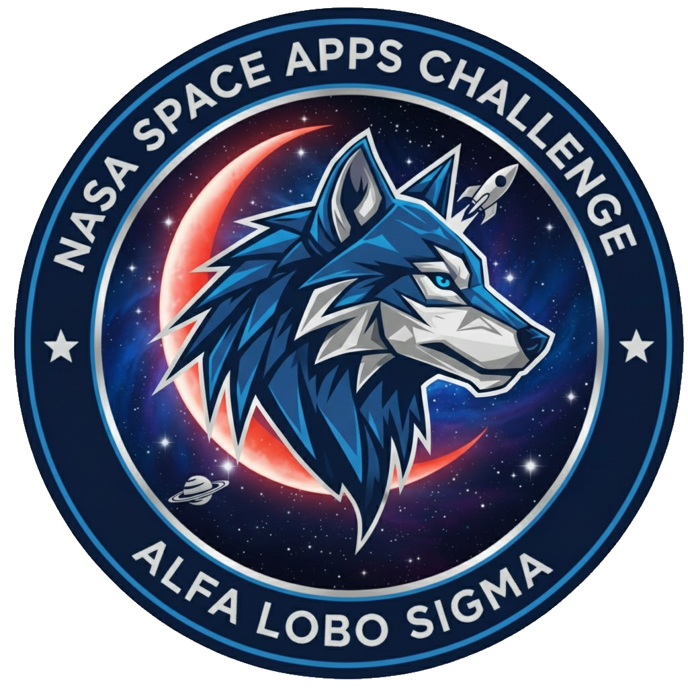

# P-Dd A.R.M.O.R.
## Planetary Defense dashboard - Asteroid Risk Modeling and Orbital Response

<div align="center">
  

  ### Developed by Team Alfa Lobo Sigma
  
</div>

---

## 📋 Project Summary

A comprehensive web-based tool for asteroid impact simulation and planetary defense planning. Built with React, TypeScript, Three.js, and Leaflet, P-Dd A.R.M.O.R. integrates real NASA NeoWs API data with physics-based impact modeling to assess Near-Earth Object threats.

**Core Features:**
- **Real-time NEO Browser**: Access 20,000+ asteroids from NASA's database with orbital parameters
- **3D Orbit Visualization**: Animated orbital mechanics with collision detection and real-time impact countdown
- **Advanced Impact Physics**: Calculate energy release, crater size, and devastation radius using validated formulas
- **USGS Geology Integration**: Terrain-specific impact modeling (continental, oceanic, sedimentary) with hazard multipliers
- **Affected Area Analysis**: Geocoded city-level damage assessment with population exposure estimates
- **Mitigation Strategies**: Time-sensitive deflection analysis (kinetic impactor, gravity tractor, nuclear disruption)
- **Educational Tools**: Interactive physics tooltips, orbital mechanics explainers, and pre-configured historical scenarios (Tunguska, Chelyabinsk)

**Technical Stack:** React 18.3, TypeScript 5.6, Three.js for 3D rendering, Leaflet for mapping, Overpass API for geocoding

**Accessibility:** Bilingual (English/Spanish), dark/light themes, mobile-responsive design, comprehensive onboarding tutorial

---

## 🚀 Getting Started

### Prerequisites

- Node.js 18+ and npm

### Installation

1. Clone the repository
```bash
git clone https://github.com/Alfa-Lobo-Sigma/SpaceApps-Challenge.git
cd SpaceApps-Challenge
```

2. Install dependencies
```bash
npm install
```

3. Run development server
```bash
npm run dev
```

The application will be available at `http://localhost:5173`

### Build for Production

```bash
npm run build
```

### Preview Production Build

```bash
npm run preview
```

---

## 🎯 What It Does & How It Works

P-Dd A.R.M.O.R. is an interactive planetary defense dashboard that simulates asteroid impact scenarios using real NASA data combined with validated physics models.

### Key Capabilities:

**1. Browse Real Asteroids**
- Access NASA's NeoWs database of 20,000+ Near-Earth Objects
- Complete orbital parameters (semi-major axis, eccentricity, inclination)
- Filter by name, hazard status, and diameter

**2. Visualize 3D Orbits**
- Real-time animated orbits around the Sun with Earth's position
- Collision detection that pauses simulation on impact
- Countdown timers based on close approach dates
- Interactive camera controls (drag to rotate, scroll to zoom)

**3. Model Impact Physics**
- Calculate mass using diameter and density
- Kinetic energy (½mv²) with TNT equivalent (megatons)
- Crater diameter using scaling laws from impact physics research
- Devastation radius with shock wave propagation

**4. Apply Geological Context**
Integrate USGS Global Lithological Map data to adjust impact effects:
- **Continental crust** (crystalline rock): +10% devastation, +5% crater size
- **Oceanic basins**: -25% air blast, +80% tsunami potential
- **Sedimentary platforms**: +15% crater, reduced ejecta velocity

**5. Assess Real-World Damage**
- Query Overpass API to identify cities within devastation radius
- Calculate distances using Haversine formula
- Estimate population exposure
- Multi-hazard modeling (shock, thermal, seismic, tsunami)

**6. Evaluate Mitigation Options**
Analyze deflection strategies with time-dependent success probabilities:
- Kinetic impactor (years needed)
- Gravity tractor (decades needed)
- Nuclear disruption (last resort, months possible)

---

## 🎓 Benefits

### For Educators:
- Interactive physics demonstrations with real data
- Historical scenarios (Tunguska 1908, Chelyabinsk 2013)
- Bilingual support (English/Spanish) for diverse classrooms
- Physics tooltips explaining energy, momentum, orbital mechanics

### For Researchers:
- Validated physics formulas from peer-reviewed literature
- USGS terrain-specific modeling
- Parameter validation with realistic constraints
- Export capabilities for documentation

### For Public Awareness:
- Accessible visualizations of complex orbital mechanics
- Real NASA data demonstrates actual threats
- Mitigation strategies show feasibility of planetary defense
- Tutorial system guides new users through features

### For Emergency Planners:
- City-level impact assessment
- Population exposure calculations
- Multi-hazard modeling
- Terrain-specific damage multipliers

---

## 💡 Intended Impact

**Educational Impact:**
- Demystify asteroid threats through interactive exploration
- Teach orbital mechanics, impact physics, and planetary science
- Combat misinformation with NASA-validated data
- Inspire STEM interest through real-world applications

**Public Awareness:**
- Highlight that asteroid impacts are rare but preventable
- Show planetary defense is scientifically viable
- Demonstrate importance of space situational awareness
- Encourage support for detection and deflection programs

**Scientific Contribution:**
- Open-source platform for impact scenario modeling
- Integration of geology into impact assessment
- Accessibility of complex calculations previously requiring specialized software

**Policy Support:**
- Visual evidence for funding planetary defense programs
- Scenario planning for emergency response coordination
- Risk communication tool for stakeholders

---

## 🛠️ Technical Stack

### Frontend Framework:
- React 18.3.1 with TypeScript 5.6.3
- Vite 6.3.6 for fast development and optimized builds
- Tailwind CSS for responsive design

### 3D Visualization:
- Three.js r0.171.0 for WebGL rendering
- OrbitControls for interactive camera
- CSS2DRenderer for labels
- Custom orbital mechanics implementation (Kepler's laws)

### Mapping:
- Leaflet 1.9.4 for 2D interactive maps
- OpenStreetMap tiles
- Circle overlays for devastation/crater visualization
- Click-to-select impact location

### Data Sources:
- NASA NeoWs API (real asteroid data)
- USGS Global Lithological Map (terrain classification)
- Overpass API (OpenStreetMap geocoding)
- Custom scenario database (historical impacts)

### State Management:
- React Context API for theme/language
- Custom hooks for data fetching
- LocalStorage for user preferences
- URL state for sharing scenarios

### Physics Implementation:
- Validated impact energy formulas
- Collins et al. crater scaling laws
- Terrain-specific hazard adjustments
- Population density modeling

---

## 🎨 Creative Aspects

**1. Geology-Aware Impact Modeling**
Unlike most impact calculators that use generic formulas, we integrate USGS lithological data to provide terrain-specific predictions. A 1km asteroid hitting sedimentary rock creates a 15% larger crater than hitting crystalline crust, and oceanic impacts generate massive tsunamis while reducing air blast effects by 30%.

**2. Real-Time Orbital Mechanics**
Instead of static diagrams, users watch asteroids and Earth orbit the Sun in real-time (with adjustable time scale up to 50 million×). The simulation detects proximity collisions, pauses automatically, and displays countdown timers based on actual close approach dates from NASA data.

**3. Educational Storytelling**
Six pre-configured scenarios tell the story of real impacts:
- Tunguska (1908): Airburst mystery
- Chelyabinsk (2013): Modern near-miss
- Chicxulub (66 million years ago): Dinosaur extinction
- Hypothetical urban impacts for emergency planning

**4. Multi-Hazard Integration**
Beyond simple blast radius, we model shock wave propagation, thermal radiation, seismic effects, tsunami generation, and ground stability.

**5. Bilingual Accessibility**
Complete Spanish translation with cultural localization, not just word-for-word conversion.

**6. Interactive Physics Education**
Hoverable tooltips explain complex concepts (momentum transfer, specific energy, perihelion) without interrupting workflow.

---

## 📁 Project Structure

```
SpaceApps-Challenge/
├── public/                    # Static assets
│   ├── logo.png              # Team logo
│   ├── fondo_meteoro.jpg     # Background image
│   └── pwa-*.png             # PWA icons
├── src/
│   ├── components/           # React components
│   │   ├── NEOBrowser.tsx    # NASA NEO browser
│   │   ├── OrbitVisualization.tsx  # 3D orbit display
│   │   ├── ImpactMap.tsx     # Leaflet map with impact zones
│   │   ├── ImpactParameters.tsx    # Physics parameter controls
│   │   ├── MitigationStrategies.tsx # Deflection analysis
│   │   ├── GeologyInsights.tsx     # USGS terrain data
│   │   ├── TabbedPanel.tsx   # UI organization
│   │   └── ...
│   ├── contexts/             # React contexts
│   │   ├── LanguageContext.tsx  # i18n support
│   │   └── ThemeContext.tsx     # Dark/light theme
│   ├── data/                 # Static data
│   │   ├── scenarioNeos.ts   # Fallback NEO data
│   │   ├── usgsGeology.ts    # Terrain profiles
│   │   ├── usgsRegions.ts    # Regional geology
│   │   └── impactScenarios.ts # Pre-configured scenarios
│   ├── types/                # TypeScript definitions
│   │   ├── index.ts          # Core types
│   │   └── geology.ts        # Geology types
│   ├── utils/                # Utility functions
│   │   ├── orbital.ts        # Kepler orbit calculations
│   │   ├── physics.ts        # Impact physics
│   │   ├── geology.ts        # Terrain analysis
│   │   ├── geocoding.ts      # City lookup
│   │   ├── validation.ts     # Input validation
│   │   └── sharing.ts        # URL state management
│   ├── App.tsx               # Main application
│   └── main.tsx              # Entry point
├── PDD Logo.png              # Project logo
└── README.md                 # This file
```

---

## 🤝 Team Alfa Lobo Sigma

- **Jonatan Mendivil**
- **Natalia Muñoz**
- **Hiram Quintero**
- **Enrique Mascote**

Built for NASA Space Apps Challenge 2025

---

## 📄 License

MIT License - see LICENSE file for details

---

## 🌟 Acknowledgments

- NASA NeoWs API for asteroid data
- USGS for Global Lithological Map
- OpenStreetMap and Overpass API for geocoding
- Three.js and Leaflet communities
- Impact physics research by Collins et al.
